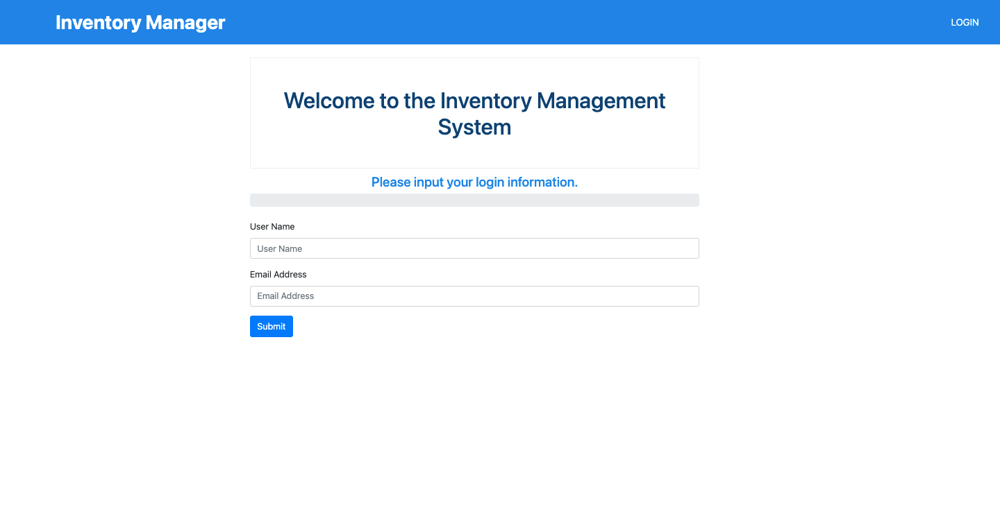
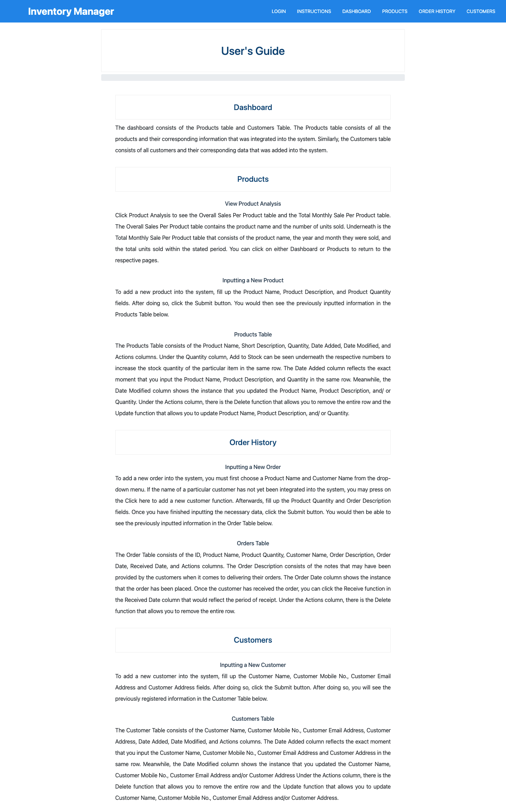
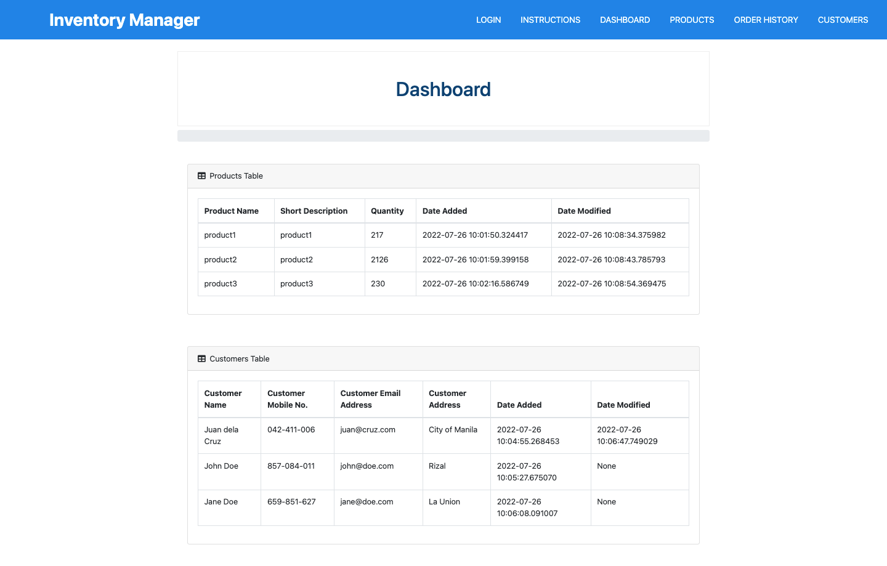
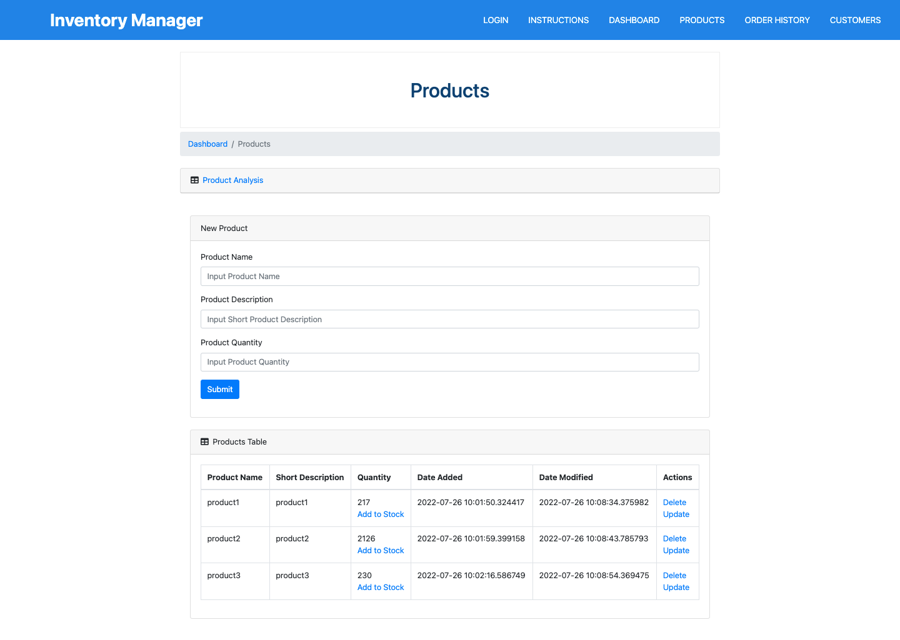
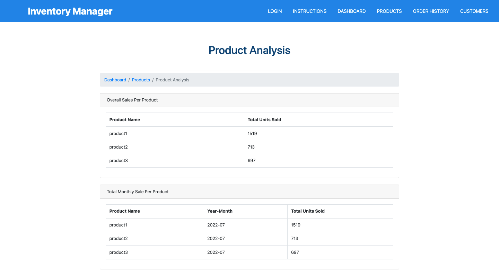
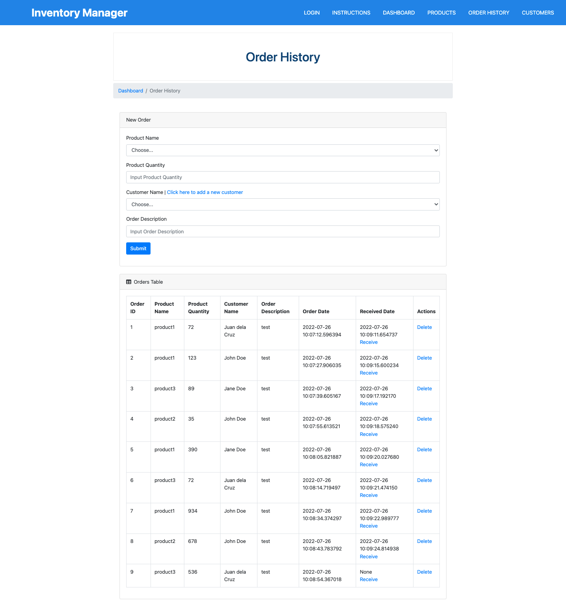
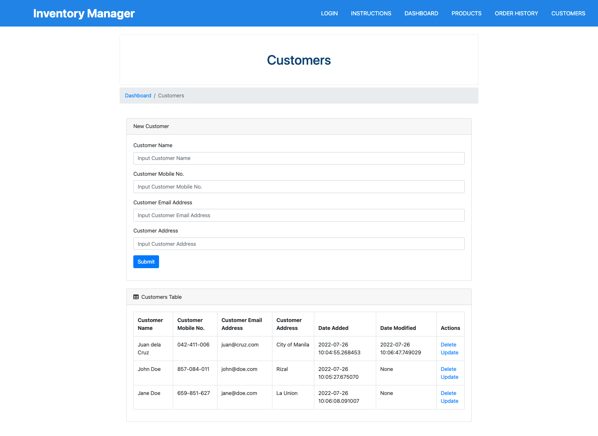

# inventory-management-app

### The group has developed a stock management inventory system that aims to track all pertinent data related to the products, orders, and customers in a particular field. A unique feature integrated into this project is an email notification system that informs the user when supplies are running low. This project is intended for small business owners to help them keep track of their available products, order history, and list of customers in line with their businesses.

Requires Python and Pip to be installed

## Installation

1. Close the git repo.

```bash
$ git clone https://github.com/toniclairedavid/inventory-management-app
```

2. Create a virtual environment and install the flask.

```bash
$ virtualenv inventory-management-app
$ . inventory-management-app/bin/activate  # on Windows, use "inventory-management-app\Scripts\activate" instead
$ pip install flask
```

3. To ensure that the application runs, go to the directory that contains "app.py"

```bash
$ cd inventory-management-app
```

## How to Run the Application?

**Before run the application, make sure you have activated the virtual enviroment:**

```bash
$ flask run
```

## Screenshots

#### This shows the login page with the user name and user email address input


#### This shows the instructions page which contains a navigation bar and the complete instructions on how to navigate the app


#### This shows the index page where you can view the product and customer database


#### This shows the products page where you can view, add, update, and delete the product database


#### This shows the product analysis page where you can view product summaries


#### This shows the order history page where you can view, add, and delete the order history database


#### This shows the customer page where you can view, add, update, and delete the customer database

